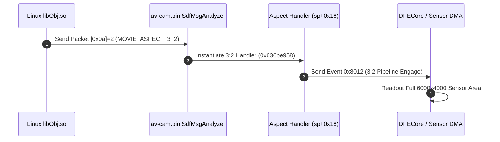

# av-cam.bin Firmware Analysis & Open Gate Pipeline Blueprint

Generated automatically via `re_avcam.py`.

## 1. Executive Ground Truth
The Sony ZV-E10 BIONZ X RTOS (`av-cam.bin`) contains full, native, pre-calculated support for:
- **3:2 Open Gate 4K**: $3240 \times 2160$ Canvas, $3264 \times 2160$ Padded DMA Buffer
- **3:2 Open Gate FHD**: $1620 \times 1080$ Canvas, $1664 \times 1080$ Padded DMA Buffer
- **Native Sensor Readout**: $6000 \times 4000$ active optical pixels

## 2. Hardware Video Resolution Profile Tables (`0x63e43c98`)

| Mode Name | Canvas Dimensions | Padded Buffer (DMA) | Aspect Ratio | VA Location |
| :--- | :--- | :--- | :--- | :--- |
| **VGA (4:3)** | 640 x 480 | 640 x 480 | 640:480 | `0x63e43c90` |
| **FHD Standard (16:9)** | 1920 x 1080 | 1920 x 1080 | 1920:1080 | `0x63e43ca8` |
| **FHD Anamorphic (4:3)** | 1440 x 1080 | 1472 x 1080 | 1440:1080 | `0x63e43cc0` |
| **FHD Open Gate (3:2)** | 1620 x 1080 | 1664 x 1080 | 1620:1080 | `0x63e43cd8` |
| **4K Standard (16:9)** | 3840 x 2160 | 3840 x 2160 | 3840:2160 | `0x63e43cf0` |
| **4K Anamorphic (4:3)** | 2880 x 2160 | 2880 x 2160 | 2880:2160 | `0x63e43d08` |
| **4K Open Gate (3:2)** | 3240 x 2160 | 3264 x 2160 | 3240:2160 | `0x63e43d20` |

## 3. Physical Sensor Mode Geometry

| Mode Table | Total Optical Area | Effective Area | Active Recording Area | Preview Binning Area |
| :--- | :--- | :--- | :--- | :--- |
| **Still Photo Mode (Native 3:2 Full Scan)** | 6048 x 4108 | 6024 x 4024 | **6000 x 4000** | 12 x 12 |
| **Movie Mode (Video Scan & Crops)** | 6048 x 4108 | 6024 x 4024 | **6000 x 4000** | 12 x 12 |
| **High-Speed / S&Q Mode** | 6048 x 4108 | 6024 x 4024 | **6000 x 4000** | 12 x 12 |

## 4. Aspect Ratio IPC Protocol & Event Chain

## 5. C++ Class Hierarchy Summary
- Total RTTI Classes Discovered: **709**
- Subsystems Identified:
  - `Camera::DFECore`: Sensor Digital Front-End & Bayer DSP
  - `Sdf*`: Sensor Driver Framework & IPC routing
  - `imola*`: BIONZ X Hardware AVC/HEVC Encoder Driver
  - `tcub*`: Time Code Unit Base & Frame Rate Engine
